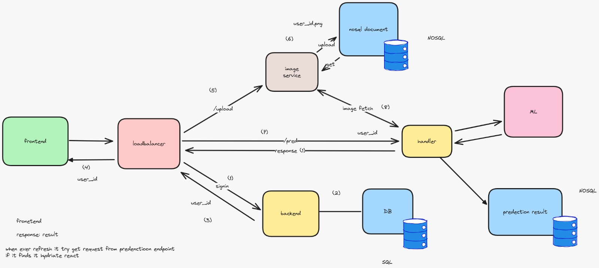
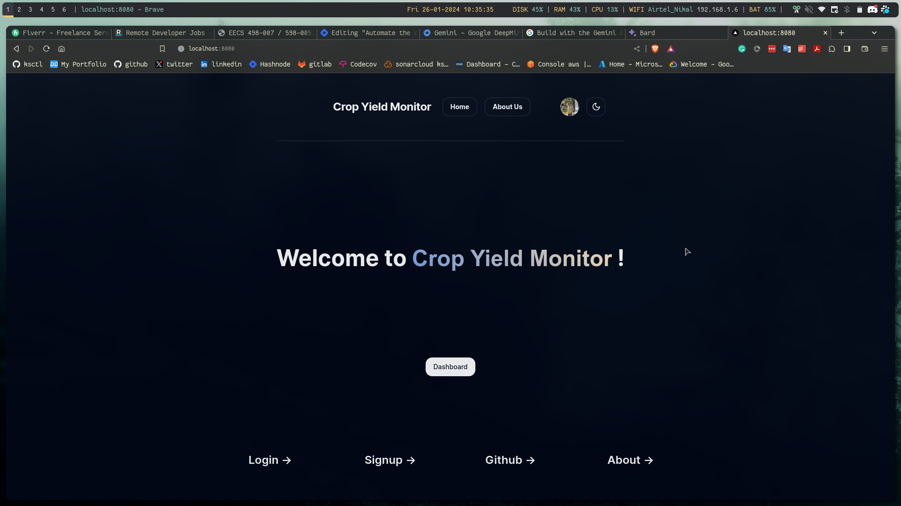

# crop-yield-monitor

# Project Documents
- [Project Docs](https://docs.google.com/document/d/1OA2uJ1kn7ileYLgplpS6gbcuHSR6UofU6R5m0gyzHmE/edit?usp=sharing)

- **Design Doc** -> folder `design/`



# Screenshots


# Demo Try

```bash
make build # build all the containers

make run # run the docker compose up -d

# Visit the browser in localhost:8080

make destroy # to stop the containers

make destroy_all # to delete all the images for crop-yield-monitor
```
